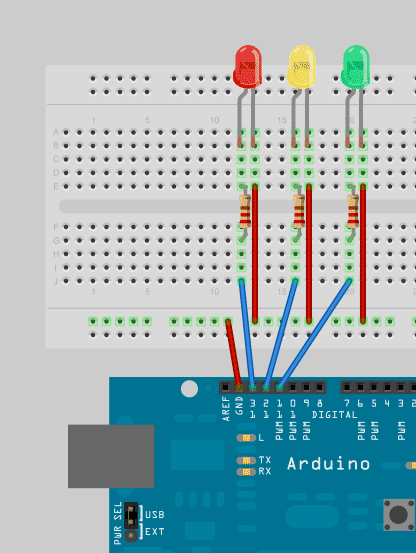
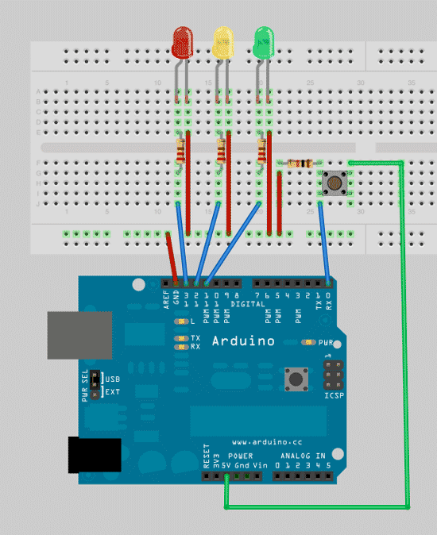

# Traffic-Light
Arduino Project: Using the arduino board to control LED light. This is a simple project that you can put together in about 30 minutes. The code is also fairly simple to understand since the function deals with input/output

## Setup
### Hardware:
- Input

I don't know how to make a schema so I used Fritzing to build the visual schema.



The code for the basic setup
```
//initial setup value
int red = 13;
int yellow = 12;
int green = 11;
int wait_time = 5000;

// put your setup code here, to run once:
void setup() {
  //set up the pin output
  pinMode(red,OUTPUT);
  pinMode(yellow,OUTPUT);
  pinMode(green,OUTPUT);
}

void loop(){
  changeLights();
  delay(wait_time);
}

void changeLights(){
  // green off, yellow for 2 seconds
  digitalWrite(green,LOW);
  digitalWrite(yellow,HIGH);
  delay(2000);

  // turn off yellow, then turn red on for 3 seconds
  digitalWrite(yellow,LOW);
  digitalWrite(red,HIGH);
  delay(3000);

  // red and yellow on for 2 seconds (red is already on though)
  //digitalWrite(yellow,HIGH);
  delay(2000);

  // turn off red and yellow, then turn on green
  digitalWrite(yellow,LOW);
  digitalWrite(red,LOW);
  digitalWrite(green,HIGH);
}
```

We can add the switch button so that when the button is press, we can change the light to green



The code for the control with switch

```
//initial setup value
int red = 13;
int yellow = 12;
int green = 11;
int wait_time = 5000;

int button = 2; // switch is on pin 2
int buttonValue = 0; // switch defaults to 0 or LOW

// put your setup code here, to run once:
void setup() {
  //set up the pin output
  pinMode(red,OUTPUT);
  pinMode(yellow,OUTPUT);
  pinMode(green,OUTPUT);

  //setup the initial state
  pinMode(button,INPUT);
  digitalWrite(green,HIGH);
}


void loop(){
  // read the value of the switch
  buttonValue = digitalRead(button);
  // if the switch is HIGH, ie. pushed down - change the lights!
  if (buttonValue == HIGH)
  {
    changeLights();
    delay(wait_time); // wait for 5 seconds
  }
}

void changeLights(){
  // green off, yellow for 2 seconds
  digitalWrite(green,LOW);
  digitalWrite(yellow,HIGH);
  delay(2000);

  // turn off yellow, then turn red on for 3 seconds
  digitalWrite(yellow,LOW);
  digitalWrite(red,HIGH);
  delay(3000);

  // red and yellow on for 2 seconds (red is already on though)
  //digitalWrite(yellow,HIGH);
  delay(2000);

  // turn off red and yellow, then turn on green
  digitalWrite(yellow,LOW);
  digitalWrite(red,LOW);
  digitalWrite(green,HIGH);
}
```
